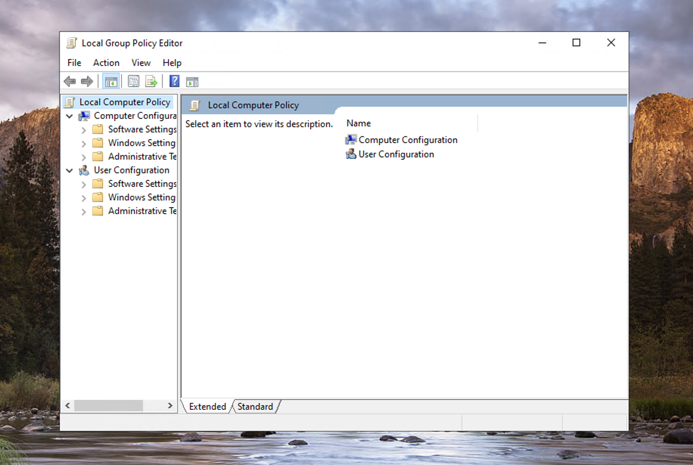
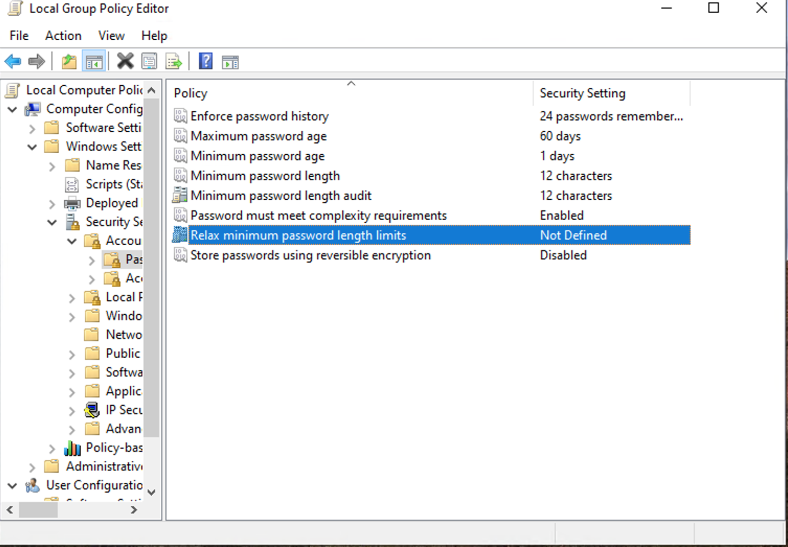
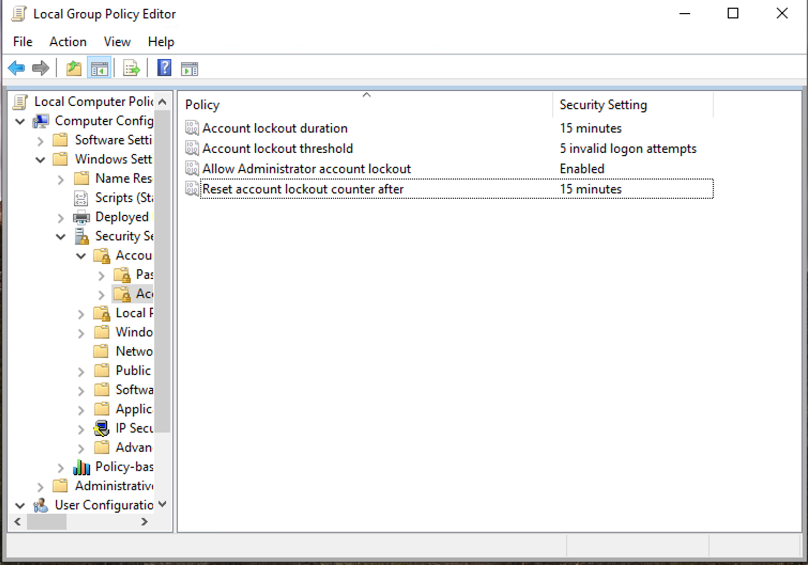
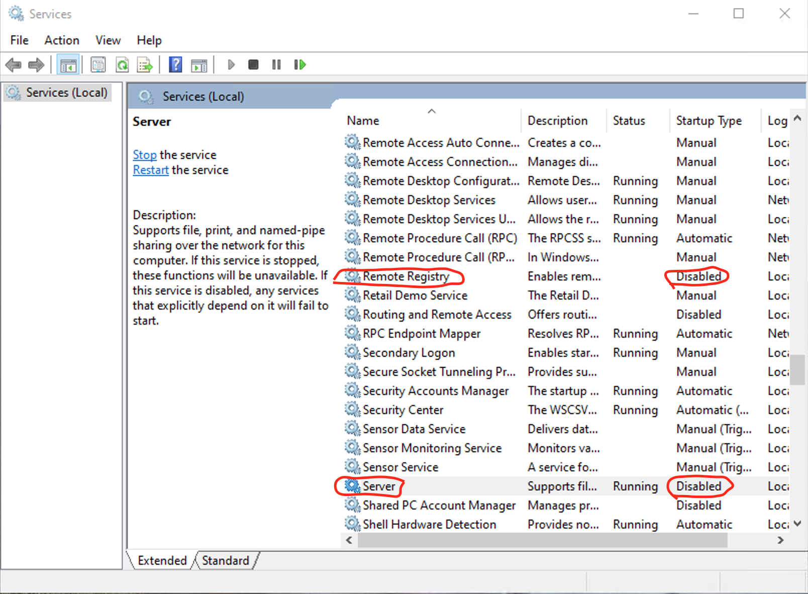
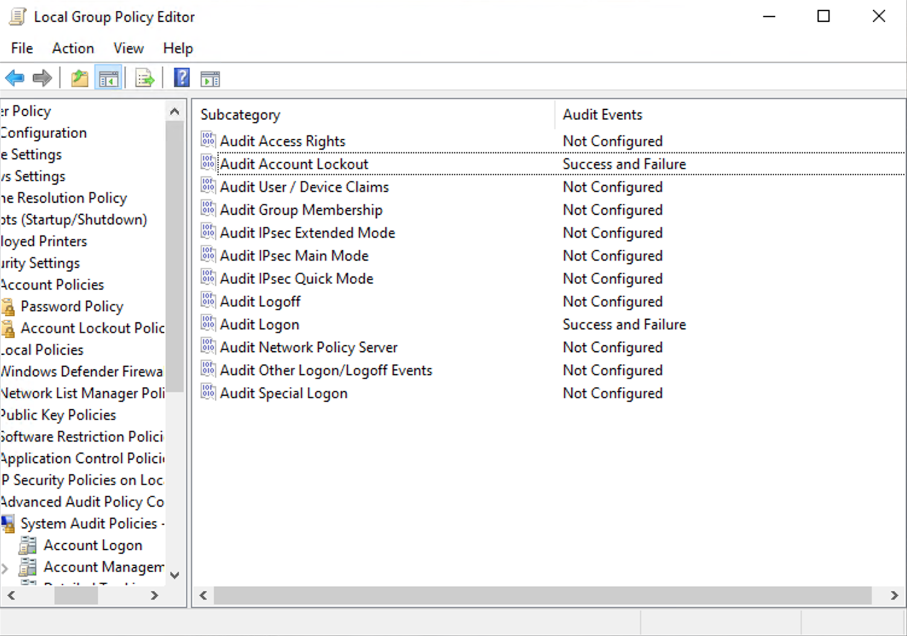
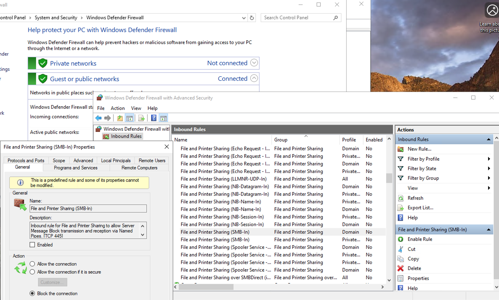
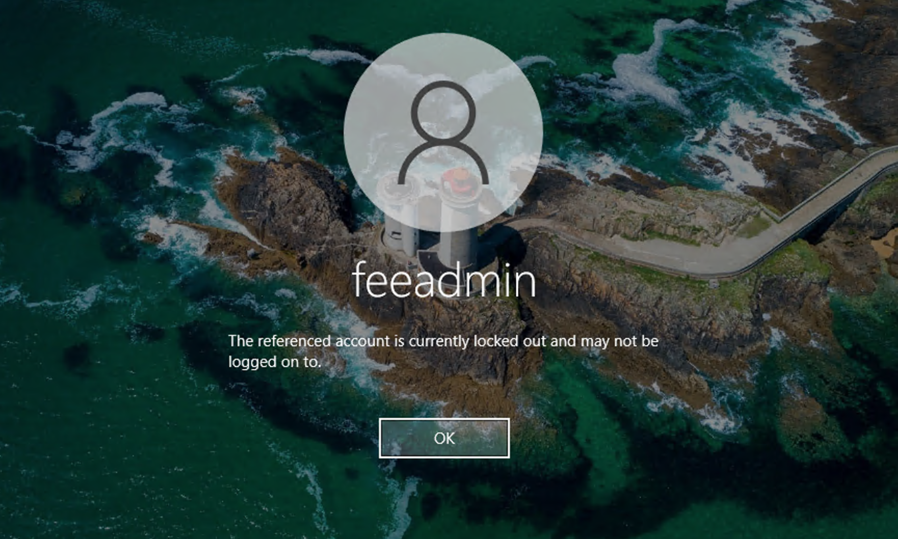
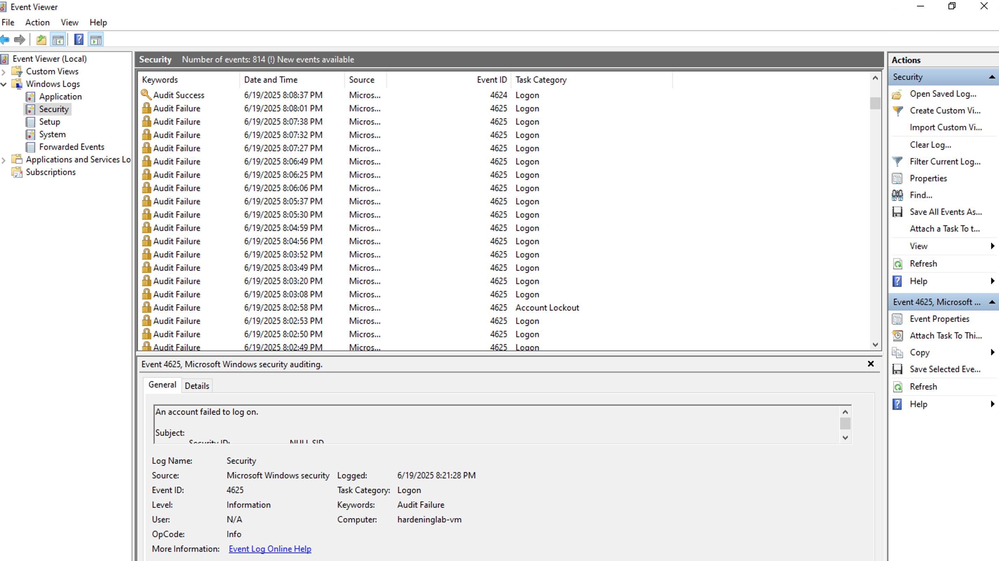

# 🔐 Windows 10 Security Hardening Lab  
**Hands-On Defensive Practice | Built-In Tools Only | SOC Analyst Prep**

---

## 🧠 Why I Did This Lab

As part of my journey toward a Tier 1 SOC Analyst role, I wanted to go beyond reading security concepts and actually apply them. This lab is a hands-on walk-through of system hardening using only built-in Windows tools inside an Azure VM. My goal was to better understand how misconfigurations create alert noise, how to spot weak security controls, and how to validate defenses through proper logging and testing.

---

## 🛠️ Tools Used

- Azure Windows 10 Virtual Machine  
- Local Group Policy Editor (`gpedit.msc`)  
- Windows Defender Firewall  
- Event Viewer  
- Native Windows audit policies  

All tools were free and came with the operating system.

---

## ✅ What I Did and Why It Matters

### 1. Opened Local Group Policy Editor  
> Used `gpedit.msc` to access and manage local security configurations. This tool is foundational for enforcing consistent password, lockout, and audit policies across a system.

### 2. Configured Password Policy  
- Enforced 12-character minimum  
- Enabled password complexity  
- Set expiration and history  
> These controls help reduce weak password usage and mitigate brute-force login attacks — a common alert type in SIEM tools.

### 3. Enforced Account Lockout Policy  
- Locked accounts after 5 failed login attempts  
- Configured auto-reset after 15 minutes  
> This stops repeated brute-force attempts and generates Event ID 4740, which is crucial for alert triage in a SOC.

### 4. Disabled Unnecessary Services  
- Disabled `Server` (SMBv1)  
- Disabled `Remote Registry`  
> These are commonly abused for lateral movement and remote access. Disabling them reduces the system's attack surface and Living-off-the-Land (LotL) risk.

### 5. Enabled Audit Logging  
- Enabled success/failure logging for logon events  
- Enabled account management and process creation events  
> Logs like 4625 (failed login) and 4688 (process creation) give analysts visibility into suspicious behavior and are essential for compliance and forensics.

### 6. Configured Windows Firewall  
- Blocked inbound SMB, RDP, and WinRM  
> This added a host-level layer of defense to prevent unauthorized access, which complements service hardening and helps detect malicious scanning.

### 7. Validated All Controls  
- Triggered lockout manually  
- Verified logs in Event Viewer  
> Validation ensures settings are enforced and events are captured. These tests mirror the type of validation SOC teams perform post-incident or after applying remediation.

---

## 📸 Screenshots

| Screenshot | Description |
|------------|-------------|
|  | 🧭 *Opened Local Group Policy Editor — starting point for hardening the system.* |
|  | 🔠*Enforced strong password rules: complexity, length, expiration, and history.* |
|  | 🚫 *Configured account lockout after 5 failed attempts to block brute force attacks.* |
|  | 📉 *Turned off Remote Registry and SMB to reduce lateral movement risk.* |
|  | 👁️ *Enabled audit logging for logons, privilege use, and process creation.* |
|  | 🧱 *Blocked inbound traffic to RDP and SMB via Windows Firewall.* |
|  | 🚷 *Verified lockout policy by entering wrong password multiple times.* |
|  | 🗂️ *Reviewed Event Viewer for logon attempts, lockouts, and process activity.* |

---

## 💡 What I Learned

This lab gave me a deeper appreciation for how prevention, detection, and visibility work together. It helped me practice interpreting Windows logs, configuring host-level defenses, and thinking like a SOC analyst when reviewing alerts or endpoint behavior. This is the kind of foundational work that supports accurate triage and effective escalation in real-world environments.

---
